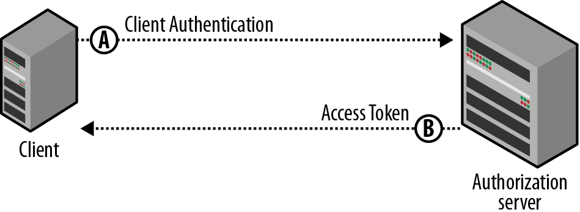

# OAuth2 Client Credentials（客户端证书授权）开放授权

## 适用范围

适合用于访问一些**公开资源**（不适合于访问类似用户私人数据这样的资源），比如微博广场首页的微博数据。第三方应用以**应用本身身份**而不是用户身份来读取和修改这些资源。

所以这种授权模式比较适合**平台合作方式**的授权。

## 工作流程



### A. 用Client Credentials换Access Token（访问令牌）
假如example.com是OAuth2服务端，则先用如下Shell脚本请求获取Access Token：

```shell
curl -X POST -d "grant_type=client_credentials\
&client_id=c596bd6f3d994df18ed7df90656980bf\
&client_secret=14decc9f4298477db2c35a951ddbc368\
&scope=user_r" \
https://open.example.com/oauth/access_token
```

几点说明：
* 建议用HTTP POST方式请求
* grant_type、client_id、client_secret都是必选参数，scope是可选参数
* grant_type必须为固定值client_credentials
* client_id和client_secret分别为引用的appKey和appSecret，这两个参数可以放在HTTP头中（OAuth2服务端可以提供两种扩展HTTP请求头，比如X-OAuth2-clientID和X-OAuth2-clientSecret），也可以放在查询参数中

如果认证成功，则返回Access Token：

```json
{
    "access_token":"e4cf99facd9948489301da932494c9b1",
    "expires_in": 86400
}
```

### B. 使用Access Token访问资源
将Access Token放在HTTP Authorization头或者查询参数中，请求访问资源：

```shell
curl https://open.example.com/hot_topics?access_token=e4cf99facd9948489301da932494c9b1
```

### C. 其他扩展

因为严格来说，这种模式不属于OAuth要解决的问题范畴，所以我们可以扩展这种模式，只要**认证服务器能够以某种身份验证客户端身份即可**。

比如我们可以扩展一种**临时授权模式**，分配一个临时key（过一段时间会失效）给应用，应用通过临时key获取到一个临时访问令牌，通过这种方式获取的访问令牌有下面特点：

* 有效期比通过服务端授权码授权模式得到的访问令牌短得多
* 通过这种临时访问令牌能访问的资源比其他方式要少得多