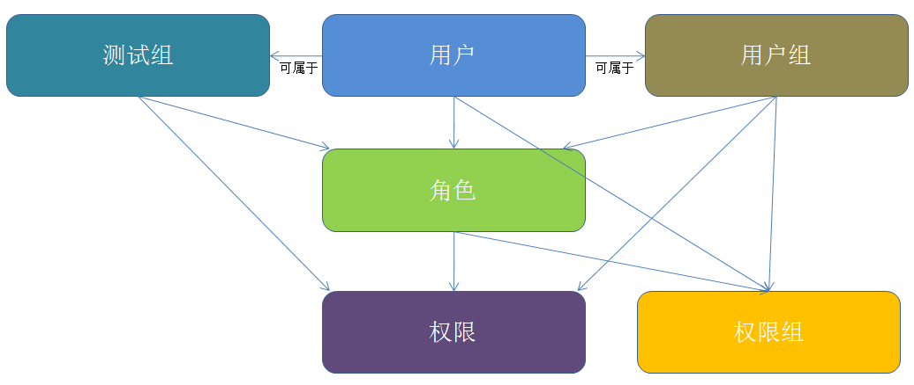

# 权限设计简要概括

## 1、权限设计的方案选择

### 1.1、RBAC权限模型
RBAC（Role Base Access Control，基于角色的访问控制协议）是企业应用管理系统（比如CRM、OA等系统）用得最多的一种访问权限控制协议。其示意图如下（这是最全面也最复杂的情况）：



RBAC的优点是比较通用，可以细粒度控制每个用户的权限。缺点是层级太多，实现起来笨重，使用起来也笨重。更多内容请参考这篇博客：<a href="http://my.oschina.net/feichexia/blog/289532">RBAC权限系统设计之我见</a>

### 1.2、weight-based权限模型
weight-based权限控制模型是一种基于权值的比较简单的权限控制模型，是我在设计开放平台项目中的权限系统时想出来的一种权限控制模型，这个名词也是我自己起的。思路大概如下：

> 有用户表、角色表和权限表。每个用户唯一对应一种角色，每种角色包含一个weight的属性，表示这种角色的权限等级值。权限表中的每一种权限也包含一个weight属性，表示这种权限的权限等级值。
> 
> 假如张三对应的角色R1的weight值为5，那么张三就获得了权限表中所有weight值小于等于5的权限。
>
> 这种方案的优势在于不用显式维护权限与用户的映射关系，判断权限清晰明了。

> 但缺点也很明显，那就是没法细粒度控制某个用户拥有的权限。比如有一个权限A且weight为3，有角色R1且weight为5，张三的角色为R1，那么按照上面这种模型张三就一定拥有权限A。

最开始我按照RBAC协议设计了开放平台的权限模型，可后面与产品沟通后认为这种方案也满足要求，于是最终采用这种方案。

## 2、其他

### 2.1、2的N次幂与位运算运用
有时候，我们可以给每个权限依次赋予权值2^0、2^1、2^2...，而某个用户可能拥有多个权限，那么就让这个用户也带上一个权值属性，并且让权值等于它拥有的所有权限的权值进行或运算，而要判断某个用户是否拥有某个权限时只需要让该用户的权值与那个权限的权值进行与运算，如果结果等于权限的权值，那么说明有该权限，反之则没有。

比如有三种权限P1：1，P2：2，P3：4，假如有用户U1拥有P1和P3两种权限，那么U1的权值为1 | 4 = 5。现在要判断U1是否有P1权限，5 & 1 = 1，所以有P1权限；再判断U1是否有P2权限，5 & 2 = 0，所以没有P1权限。

### 2.2、分层权限

在设计权限时有时候可以采用层次结构，一般的语法结构如下（支持通配符）：

```html
资源:子资源:操作
```
比如user、email都是资源，email是user的子资源，而操作可以抽象出一套通用操作比如create、read、update、delete。

* 如果权限为user或者user:*，那么表示拥有对用户资源以及用户资源的子资源email的所有权限
* 如果权限为user:email，则表示拥有对用户子资源email的所有操作的权限，它等价于user:email:*
* 如果权限为user:email:read，则表示拥有对用户子资源email的读权限

另外也可以扩展通配符，比如支持非、或、与等，举个栗子：user:email:~read可以表示没有对用户子资源email的读权限。

还有MySQL的数据权限系统也是一种层次结构(MySQL也包含用户组、角色的概念)，在INFORMATION_SCHEMA这个数据库里，包含这么几张与权限相关的表：

* USER_PRIVILEGES
* SCHEMA_PRIVILEGES
* TABLE_PRIVILEGES
* COLUMN_PRIVILEGES

#### 问：
如何判断某个用户root是否拥有对某个字段的UPDATE权限？

#### 答：
先去USER_PRIVIELGES表中查找某个用户的权限，如果查到并拥有UPDATEi权限，那么该用户就拥有对所有库、表、字段的该种类型的权限。

反之，如果没有，就再去SCHEMA_PRIVILEGES库权限表查用户是否拥有对那个字段所属数据库的UPDATE权限，如果有则用户root拥有那个字段的UPDATE权限。

反之，如果没有，就再去TABLE_PRIVILEGES表权限表查用户是否拥有对那个字段所属表的UPDATE权限，如果有责用户root拥有那个字段的UPDATE权限。

...


